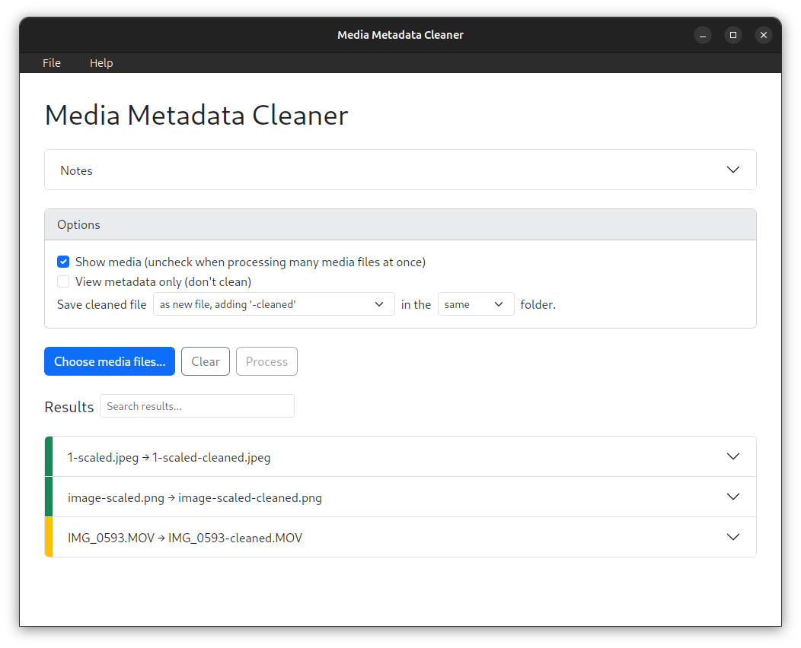

# media-metadata-cleaner

Desktop app that removes metadata from images using [exiftool](https://exiftool.org).

To get started, see the [user guide](https://theotternews.github.io/media-metadata-cleaner/)



## Installation

Download and install the latest release for your platform from **[Releases](https://github.com/theotternews/media-metadata-cleaner/releases/latest)**.

## Usage

1. Choose desired processing options.
2. Choose image file(s) to clean, multiple selection is allowed.
3. Each file gets a row in the results: green rows succeeded; yellow had warnings; red had errors. Click the row title to expand details.
4. Cleaned files are written next to the originals with a `-cleaned` suffix (e.g. `photo.jpg` → `photo-cleaned.jpg`).

### Notes
1. All processing happens locally, no data is uploaded.
2. Use correct file extensions (e.g. don’t name a JPEG `.png`)
3. For metadata removal, `exiftool` is invoked with flags `-all:all= -CommonIFD0= -TagsFromFile @ -ColorSpaceTags -Orientation -ResolutionUnit -XResolution -YResolution`. See exiftool's [options documentation](https://exiftool.org/exiftool_pod.html#OPTIONS).

## Development

### Prerequisites
1. [Node.js](https://nodejs.org/)
2. [Rust](https://rustup.rs/)

```bash
git clone https://github.com/theotternews/media-metadata-cleaner.git
cd media-metadata-cleaner
npm install
```

### Test in development

```bash
npm run tauri dev
```

### Build distributable on your platform

```bash
npm run tauri build
```

Output installer(s) will be in `src-tauri/target/release/bundle/`.

## License

This project is released under the [Anti-Capitalist Software License (v 1.4)](https://anticapitalist.software/). See [LICENSE](LICENSE) for the full text.
